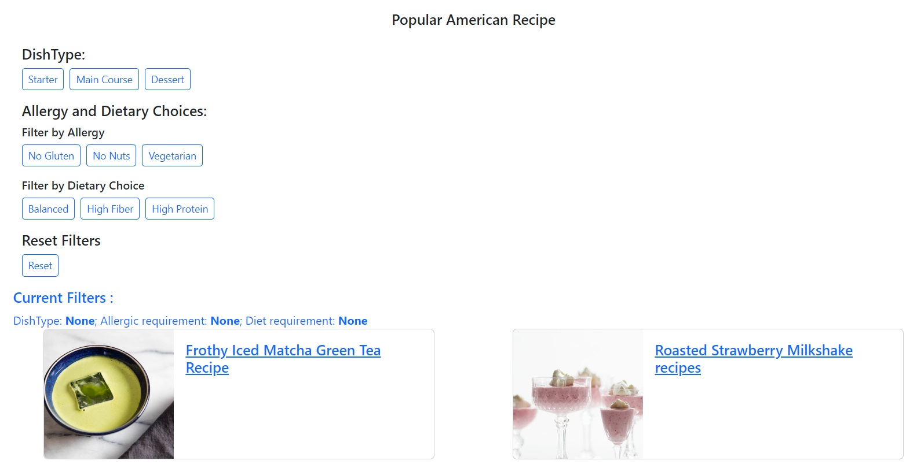
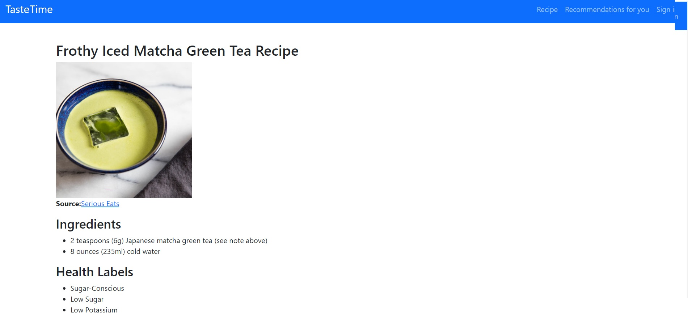
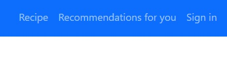
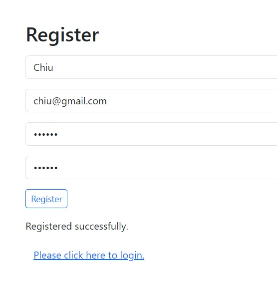
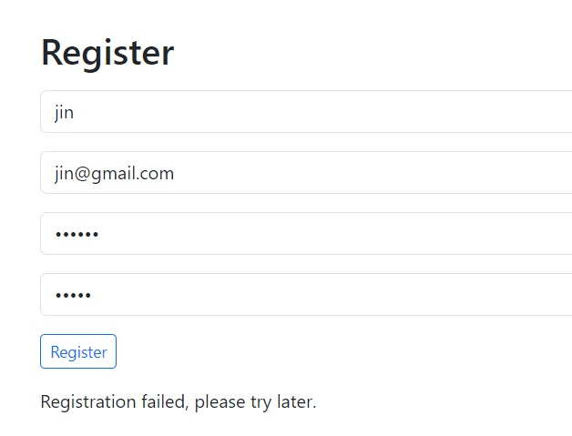
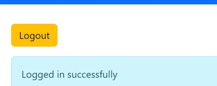
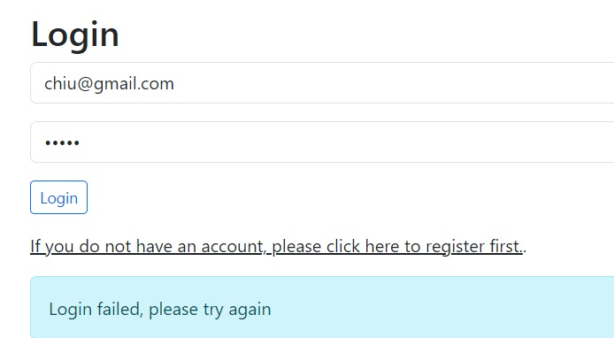
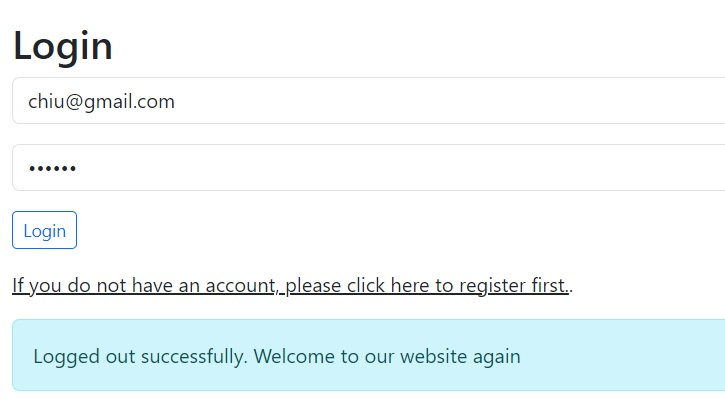
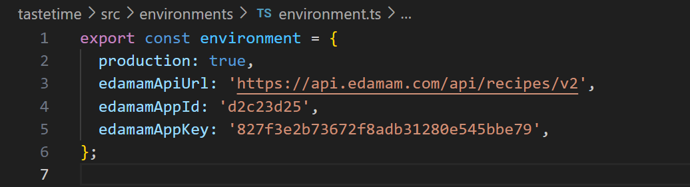

# Technical Project Description for tastetime APP

> App Link
[frontend in netlify](https://cheerful-pasca-6e4742.netlify.app/) & 
[backend in render](https://u06-fullstack-recipe-app-cherryliuliuchen.onrender.com/api/register)

## Executive Summary
### Description of the Application
> The tasteime application is a web-based task management tool designed to show users about recipe and recommendations. Built using Laravel for backend, Angular for frontend and [edamam](https://developer.edamam.com/edamam-docs-recipe-api) for recipe API. 

## Operating Environment
### Technical Architecture
> The taste application follows a client-server architecture. The client-side is implemented using HTML for structure, bootstrap for styling, and PHP for server-side scripting. The web interface is designed to be responsive and user-friendly, supporting various devices and screen sizes.

### Frontend Structure Diagram
> Below is the ER diagram for database

## Modules
### Functional Overview
> The application comprises several key modules, each serving a specific purpose for users. These modules include Recipe, Recommendations for you, Recipe details and Sign in. Users can register, login and logout.

### Detailed Module Description
#### Recipe
> Users can see all American type recipe from edamam. User can filter the DishType, Allergy and Dietary Choices(Allergy & Dietary Choice) and can reset the filter. Users can click the link to see the details for the recipe.

#### Recommendations for you
> Users can see the recomendations on this page.

#### Recipe details
> Users can click the link on Recipe page and Recomendations page. Users can see the details on this page.

#### Sign in
> The "Signin" button allows users to manage their account.

> ##### First, new user can register.

> ##### Second, registered user can login.

> ##### Third, user can logout.

## How to download and build locally
> This project was generated with [Angular CLI](https://github.com/angular/angular-cli) version 17.3.1.

###  Development server
> Run `ng serve` for a dev server. Navigate to `http://localhost:4200/`. The application will automatically reload if you change any of the source files.

###  Code scaffolding
> Run `ng generate component component-name` to generate a new component. You can also use `ng generate directive|pipe|service|class|guard|interface|enum|module`.

###  Build
> Run `ng build` to build the project. The build artifacts will be stored in the `dist/` directory.

###  Modify environments information
> If you want to change the APIKey, modify it in tastetime\src\environments\environment.ts

## Version Information
> Draft version 29th Mar,2024  
> Update the user interface 2th Apr,2024  
> Final version 3rd Apr,2024

